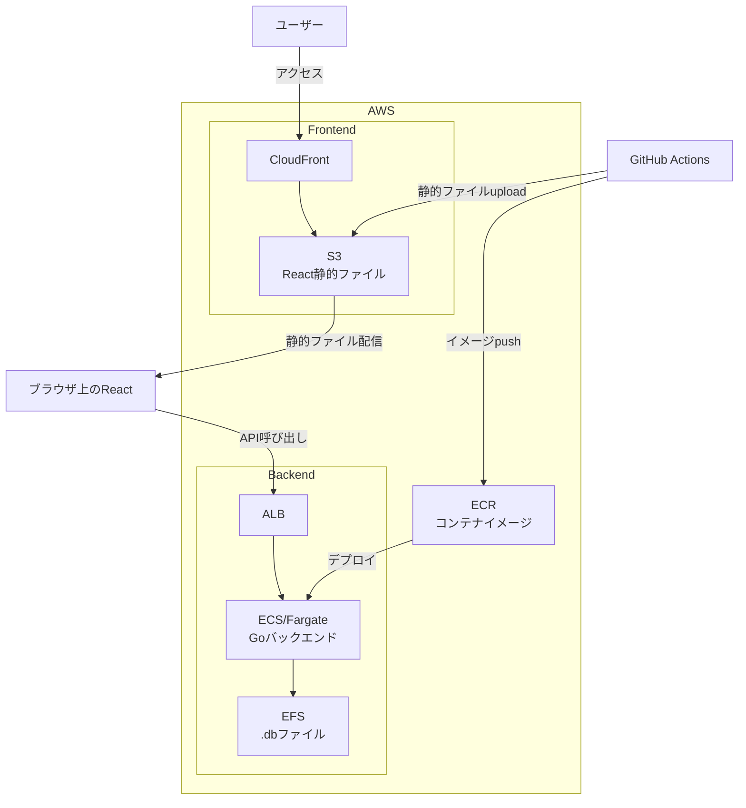

# デプロイ設計

## 構成図



---

## フロントエンド

- **ホスティング**: S3 + CloudFront
- **ビルド**: `npm run build` → 静的ファイルをS3にアップロード

---

## バックエンド（Go）

- **ホスティング**: ECS/Fargate
- **コンテナレジストリ**: ECR
- **永続ストレージ**: EFS（`.db` ファイルの永続化）

---

## CI/CD

- GitHub Actions で自動デプロイ
- `main` ブランチへのマージ → 本番デプロイ
- `stage` ブランチへのマージ → ステージングデプロイ

```
push to stage → ステージング環境へデプロイ
merge to main → 本番環境へデプロイ
```

---

## CORS

ReactのオリジンをGoバックエンドで許可する設定が必要。

---

## 未定事項

- ステージング環境のインフラ構成
- 認証サービス（Cognito等）の採用有無
- データベースのバックアップ戦略
