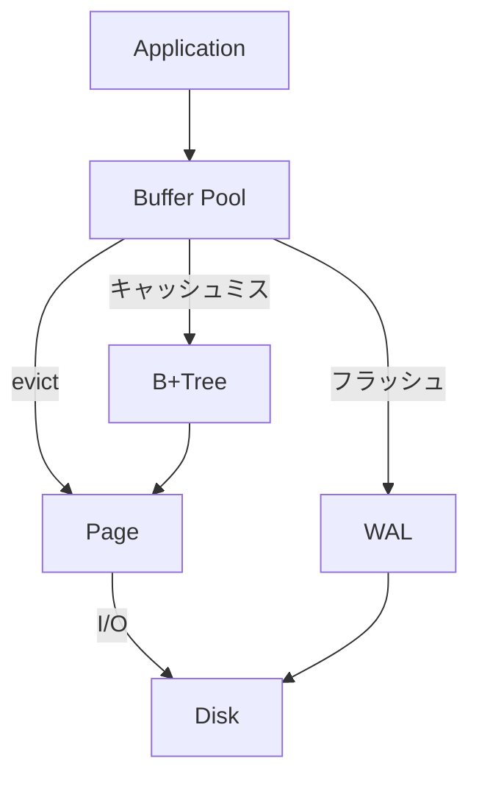

# ストレージエンジン設計

## 概要

B+Treeをベースにしたディスクベースのストレージエンジン。ページ単位でファイルを読み書きする。

---

## アーキテクチャ



---

## ページ

- サイズ: 4KB
- フォーマット: SQLiteのスロッテッドページ方式を参考に設計
- ディスクアクセス: `ReadAt` / `WriteAt`（pread/pwrite相当）

ページヘッダにはページID・LSN・セル数・空き領域情報・子ポインタ等を持つ。整数はvariantではなく固定長で表現する。詳細は実装時に決定する。

---

## B+Tree

- 内部ノード: キー + 子ページIDのポインタ
- 葉ノード: キー + 値（インライン格納）
- 葉ノード同士はリンクリストで接続（範囲スキャン用）

---

## バッファプール

- 置換ポリシー: LRU
- ページはevict時またはチェックポイント時にディスクに書く

### 学習サイトでの扱い

バッファプールを無効化し、全アクセスをそのままディスクI/Oにする。ノードアクセスのたびにディスクI/Oが発生するため、可視化しやすくなる。

---

## 並行制御

テーブル単位の `sync.RWMutex` を使う。読み取りは複数同時可、書き込みは排他。

### ユーザー分離

学習サイトでは各セッションにIDを付与し、テーブル名にプレフィックスとして付ける。セッション間でロックが競合しないため、テーブルロックのままでも複数ユーザーを同時に捌ける。

```
session_abc123_users
session_def456_users   ← 別ユーザー、別テーブル
```

---

## 採用しなかった選択肢

| 項目 | 却下した選択肢 | 理由 |
|------|--------------|------|
| 整数エンコード | varint（SQLite方式） | 実装が複雑になるため固定長を選択 |
| バッファプール置換 | Clock、CLOCK-Pro等 | LRUで十分 |
| 並行制御 | ページロック、MVCC、CoW | テーブルロック＋セッション分離で要件を満たせる |
| ページID | 位置で暗黙決定（SQLite方式） | 可視化・デバッグのためヘッダに明示 |
