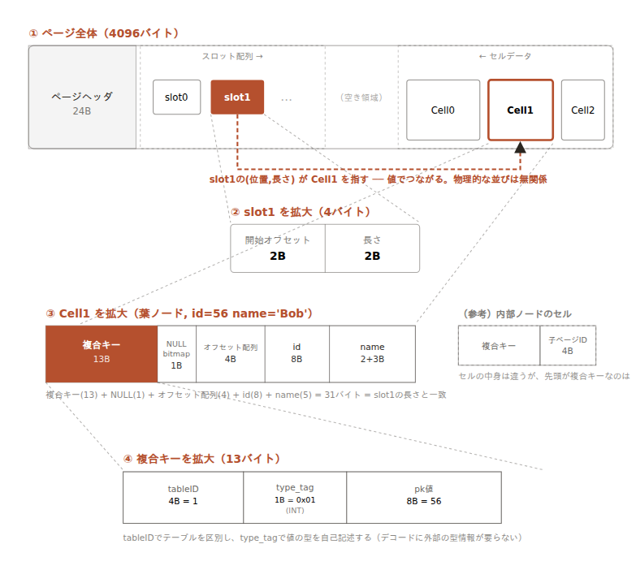

# B+Tree 仕様

## 概要

PRIMARY KEYをキーとするB+Tree。全データは葉ノードに格納し、内部ノードはキーと子ポインタのみを持つ。

---

## ノード構造

### 内部ノード

キーと子ページIDのポインタを持つ。N個のキーに対してN+1個の子ポインタを持つ（左子規約）。

```
[Child0]  Key1  [Child1]  Key2  [Child2]
```

- `Child_(i-1)` は `Key_i` **未満**を担当する（Key_iの左隣の子）
- 一番大きいキー以上は `Child_N` が担当する。これはどのキーとも組めないため、
  ページヘッダの `RightmostChild`（storage/page spec参照）に別置きする

セルは `(Key_i, Child_(i-1))` の組で `[複合キー][子ページID 4byte]` として格納する（cell.go の `encodeInternalCell`）。
探索は次のルールに従う（`findChildPageID`）。

```
key < Key1        → Child0（cell0の子）
Key1 <= key < Key2 → Child1（cell1の子）
...
KeyN <= key        → RightmostChild
```

### 葉ノード

キーと値（レコード）をインラインで保持する。葉ノード同士はリンクリストで接続する（範囲スキャン用）。

```
[Key0: Record0][Key1: Record1]...
```

次の葉ページIDは、内部ノードでは子ポインタとして使う `RightmostChild`（ページヘッダ20〜24byte、storage/page spec参照）を
葉ノードでは転用して格納する（`nextLeafID` / `setNextLeafID`）。

---

## 操作

### 検索

ルートページIDはファイルヘッダから取得する。ルートから内部ノードを辿り、対象の葉ノードに到達してレコードを返す。

### 挿入

葉ノードに空きがあればそのまま挿入する。葉ノードが満杯の場合はページ分割を行い、親の内部ノードを更新する。ルートが分割された場合は新しいルートを作成し、ファイルヘッダのルートページIDを更新する。

### 削除

葉ノードから対象レコードを削除する。ページのマージはシンプルさのため初期実装では省略する。

### 範囲スキャン

葉ノードのリンクリストを辿ることで効率的な範囲スキャンを実現する。

---

## PRIMARY KEY

B+TreeのキーはPRIMARY KEYカラムの値を使用する。キーの比較はカラムの型に応じて行う。

---

## キーフォーマット（複合キー）

1つのB+Treeファイルに複数テーブルのデータを格納するため、キーは以下の複合フォーマットを使用する。

```
[tableID: 4bytes BE][type_tag: 1byte][pk_bytes]
```

- `tableID`: テーブルを識別するID（カタログが自動採番）
- `type_tag`: PKの型を示すタグ（`0x01`=INT, `0x02`=VARCHAR）
- `pk_bytes`: PKの値バイト列（INTは8byte BE、VARCHARは2byte長さ + UTF-8バイト列）

型タグを埋め込んだ自己記述型のため、デコード時に外部からの型情報が不要。

ソート順はtableIDを先に比較し、同じtableID内ではpk値で比較する。これにより同じキー空間に複数テーブルのレコードが共存でき、ScanはtableIDのプレフィックス範囲スキャンで実現できる。

---

## セルの入れ子構造（具体例）

`(id INT PRIMARY KEY, name VARCHAR(50))` のテーブルに `(id=56, name='Bob')` を挿入する場合、
ページ・スロット・セル・複合キーは次のように入れ子になる。



```
ページ（4096byte）
├─ ヘッダ（24byte）
├─ スロット配列
│   └─ 1スロット（4byte）= [開始オフセット 2byte][長さ 2byte]
│        └─ この2つの値でセルデータ内の1セルを指す（隣接するスロットの位置には依存しない）
└─ セルデータ
    └─ 1セル（葉ノード, 31byte）
        ├─ 複合キー（13byte）  ← tableID(4) + type_tag(1) + id値(8)
        ├─ NULLビットマップ（1byte）
        ├─ オフセット配列（4byte）  ← カラム数(2) × 2byte
        └─ カラムデータ（13byte）  ← id(8) + name(2+3='Bob')
```

複合キーの13byteは `[tableID=1][type_tag=0x01][id=56]` の内訳。内部ノードのセルなら、
カラムデータの代わりに `[子ページID 4byte]` が続く（セルの先頭が複合キーなのは葉・内部ノードで共通）。
